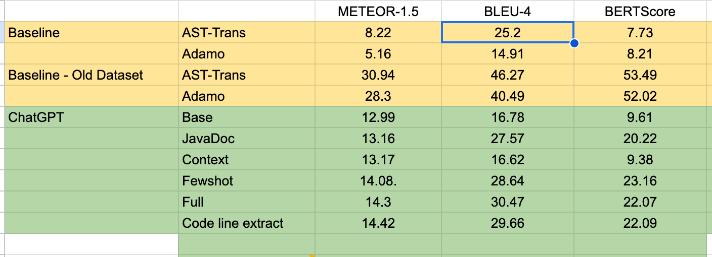

# cfg_gen
This repository help python user can extract Java method control-flow graph through [networkx](https://networkx.org/documentation/stable/index.html) library and node construction by 
[javalang](https://github.com/c2nes/javalang) library. The theory was to implement and improve from [this paper](1858996.1859006.pdf) with the aim to output a pruned input method
code for feeding into LLMs or SOTA models.

## Set up


To initiate, get requirement in conda:

```
pip install -r requirement.txt
```

## Create a control-flow graph

To create simple control-flow graph handle such simple branching as if/else, do-while, while, try, etc:

```
from methodCFG import Sunit
java_method="your java method" #your java method
sunit=Sunit(java_method)
cfg=sunit.cfg # extract root node include reference type, method name 
```

Overview of each branching node (under developement)

## Selection unit/code line remove/extract
Original selection process:

- Select all ending code line(s), where it is might be return or just ending execute the method
- Select all void method invocation code lines.
- Select method invocation has similar name toward original method name
- Select data driven code lines of previous selected code lines
- Select branching code lines that result to previous selection

Improvement:

- We also select data driven code lines for branching codition variables (if they are not overlap)

This help improve the result significantly and help it comparable to other technique while reduce 80% of input token
(our result lie in 'code line extract')




To generate sunit extraction from java files to java file, input file must not contain class or packages, only 1 method. 
### For quick start:

```
import Hung.extractSunit
input="input_java_file.java"
output="output_java_file.java"
extract(input,output)
```

### For generate sunit extraction from text to text:

```
from methodCFG import Sunit
java_method="your java method" #your java method
sunit=Sunit(java_method)
sunit.composeSunit()
print(sunit.source_code)

```
